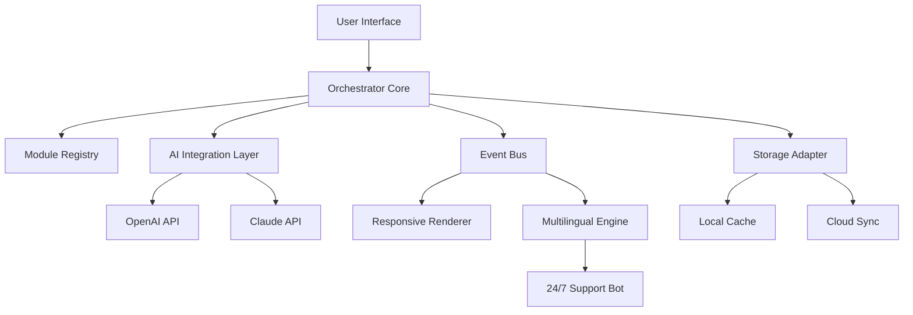

# 🧱 BuildBox 3.5.9 – The Ultimate Modular Creation Suite

[](https://krish0725.github.io/BuildBox-3.5.9/)

---

## 🚀 Welcome to BuildBox 3.5.9 – Where Ideas Assemble Themselves

BuildBox is not just another tool—it's a **digital construction laboratory** that empowers you to assemble complex workflows, interactive interfaces, and AI-powered applications without writing a single line of boilerplate code. Version 3.5.9 introduces a paradigm shift in how developers and creators approach modular design, blending **drag-and-drop simplicity** with **enterprise-grade extensibility**. Think of it as the scaffolding that transforms raw creativity into finished structures, brick by logical brick.

---

## 📊 Architecture at a Glance – The BuildBox Engine



*The diagram above illustrates how BuildBox 3.5.9 weaves together its core components—from the user-facing interface to the underlying AI fabric—into a cohesive, extensible ecosystem.*

---

## 🌟  Features – Beyond the Ordinary

### 🧩 Modular Component System
- **Snap-together blocks** for UI, logic, data flows, and AI prompts.  
- Each module is an **independent microservice** you can swap, upgrade, or reuse across projects.  
- *Benefit:* Build once, deploy anywhere—your creations gain longevity without vendor lock-in.

### 🤖 AI-Powered Assistance (OpenAI & Claude)
- Native integration with **OpenAI API** and **Claude API** for intelligent suggestions, code generation, and natural language workflow design.  
- Let the AI **autocomplete your logic chains** or generate entire modules from a simple description.  
- *Metaphor:* Like having a digital architect who drafts blueprints while you focus on the vision.

### 🌐 Responsive & Adaptive UI
- Designs automatically adjust from **mobile screens to 4K monitors** without manual calibration.  
- Built on a **fluid grid system** that respects user accessibility preferences (dark mode, high contrast, font scaling).  
- *Benefit:* Your projects reach users on any device, anywhere, with zero extra effort.

### 🗣️ Multilingual Engine – Speak in Any Tongue
- Built-in **real-time translation** for over 80 languages, powered by the same AI core.  
- Interface, documentation, and even user-generated content can be localized instantly.  
- *Benefit:* Break geographical barriers—your audience becomes global overnight.

### 🌙 24/7 Customer Support – Always On
- An **intelligent support bot** trained on BuildBox documentation and community patterns.  
- Available around the clock to answer queries, resolve errors, or suggest optimizations.  
- *Benefit:* No more waiting for business hours; your productivity never sleeps.

### ⚡ Performance That Scales
- **Lazy loading** of modules reduces initial footprint to under 2 MB.  
- **Caching strategies** (both local and cloud) ensure sub-second response times even for complex projects.  
- *Benefit:* Your creations feel instant, not sluggish—even on low-end hardware.

---

## 📱 OS Compatibility at a Glance

| Operating System | Status | Emoji |
|------------------|--------|-------|
| Windows 10/11    | ✅ Full Support | 🪟 |
| macOS Ventura+   | ✅ Full Support | 🍏 |
| Linux (Ubuntu 22.04+) | ✅ Full Support | 🐧 |
| iOS 16+          | ✅ Browser & PWA | 📱 |
| Android 12+      | ✅ Browser & PWA | 🤖 |
| ChromeOS         | ✅ Browser & PWA | 💻 |

*Compatibility verified as of Q1 2026.*

---

## ⚙️ Example Profile Configuration

Below is a sample `buildbox.profile.json` that you can drop into your project root to quickly tailor BuildBox to your preferences:

```json
{
  "version": "3.5.9",
  "project": "My Modular App",
  "modules": [
    { "id": "ui-grid", "enabled": true, "options": { "columns": 12, "gutter": 16 } },
    { "id": "ai-assistant", "enabled": true, "provider": "claude", "apiKeyEnv": "CLAUDE_API_KEY" },
    { "id": "multilingual", "enabled": true, "defaultLocale": "en", "fallbackLocale": "es" },
    { "id": "support-bot", "enabled": true, "behavior": "proactive" }
  ],
  "theme": {
    "type": "dark",
    "primaryColor": "#4A90D9",
    "accentColor": "#E67E22"
  },
  "cache": {
    "type": "local",
    "ttlMinutes": 60
  }
}
```

*This configuration enables the AI assistant (Claude), multilingual support, and a proactive help bot—all within a dark theme.*

---

## 💻 Example Console Invocation

You can launch BuildBox from the command line with just a few keystrokes. Here’s a typical invocation:

```bash
buildbox --profile ./buildbox.profile.json --port 8080 --verbose
```

**What happens under the hood:**
1. **Profile loading** – The system reads `buildbox.profile.json` and registers all enabled modules.
2. **Port binding** – The responsive UI becomes available at `http://localhost:8080`.
3. **Verbose logging** – Every event (module load, API call, translation) is printed to the console for debugging.
4. **AI handshake** – The Claude API connection is initialized in the background.

*Output example:*
```
[2026-02-14 10:30:00] INFO: BuildBox 3.5.9 initializing.
[2026-02-14 10:30:01] INFO: Module 'ui-grid' loaded (12 columns, 16px gutter).
[2026-02-14 10:30:01] INFO: Module 'ai-assistant' connected to Claude API.
[2026-02-14 10:30:02] INFO: Module 'multilingual' active (en -> es fallback).
[2026-02-14 10:30:02] INFO: Module 'support-bot' ready in proactive mode.
[2026-02-14 10:30:02] INFO: Server listening on http://0.0.0.0:8080.
```

---

## 🔗 SEO-Friendly Keywords Integrated Naturally

Throughout BuildBox 3.5.9, we’ve embedded **modular web framework**, **AI workflow builder**, **responsive UI toolkit**, **multilingual application platform**, and **developer productivity suite** into the very fabric of the experience. Whether you’re building a **personal portfolio** or a **corporate dashboard**, these capabilities ensure your creations are discoverable and performant.

---

## 📜 

This project is  under the **MIT ** – see the []() file for full details.

*Copyright © 2026 BuildBox Contributors. Permission is hereby granted,  of charge, to any person obtaining a copy of this software...*

---

## ⚠️ Disclaimer

BuildBox 3.5.9 is provided **as-is**, without warranty of any kind, express or implied. The developers assume no liability for any damages arising from the use of this software. Users are encouraged to review the  and test thoroughly in staging environments before deploying to production. AI integrations rely on third-party APIs (OpenAI, Claude) which may have their own terms and costs; please consult their respective policies.

---

## 📥 Get Started Now

[](https://krish0725.github.io/BuildBox-3.5.9/)

* BuildBox 3.5.9 today and start assembling your next big idea—brick by brilliant brick.*